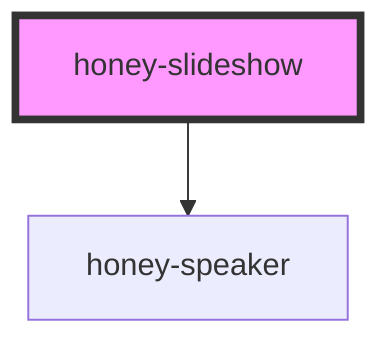

# honey-slideshow

<!-- Auto Generated Below -->

## Properties

| Property  | Attribute | Description | Type     | Default     |
| --------- | --------- | ----------- | -------- | ----------- |
| `baseurl` | `baseurl` |             | `string` | `undefined` |

## Dependencies

### Depends on

- honey-speaker

### Graph

----------------------------------------------

*Built with [StencilJS](https://stenciljs.com/)*
